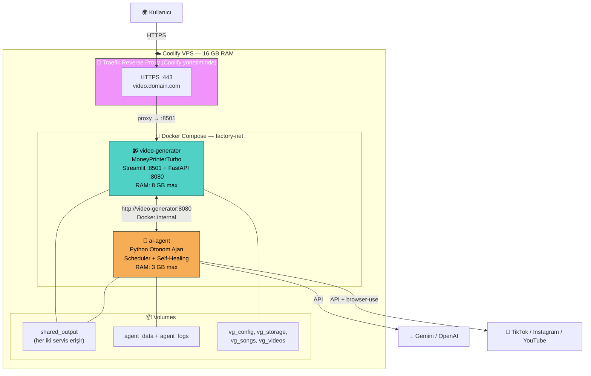
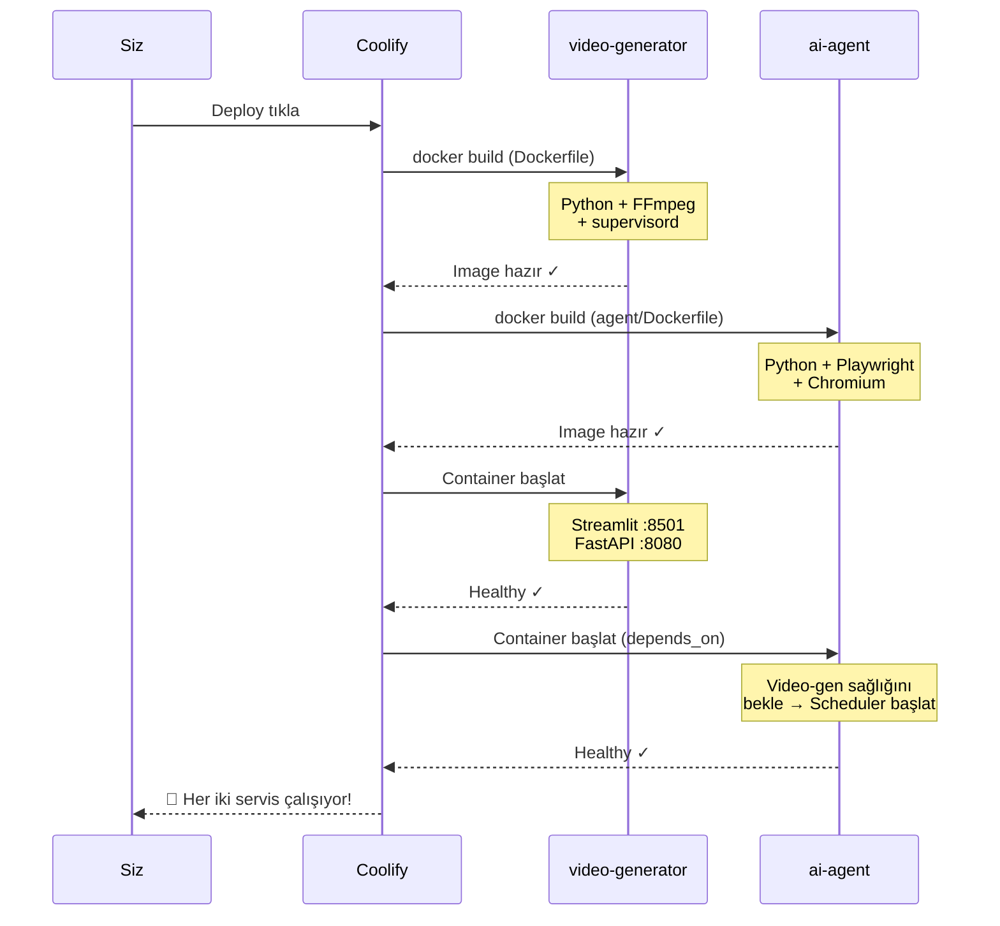
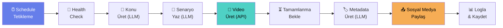

# 🏭 Otonom Video Fabrikası — Coolify Deployment Kılavuzu

MoneyPrinterTurbo video motoru + 7/24 otonom AI Agent, tek bir Docker Compose projesi olarak Coolify'a deploy edilir.

---

## 📐 Mimari



---

## 📁 Proje Dosya Yapısı

| Dosya | Boyut | Açıklama |
|---|---|---|
| [Dockerfile](file:///d:/Gemini/Projects/AutomationVideo/Dockerfile) | 3.7 KB | Video generator imajı (Python + FFmpeg + supervisord) |
| [supervisord.conf](file:///d:/Gemini/Projects/AutomationVideo/supervisord.conf) | 1.5 KB | Streamlit + FastAPI process yönetimi |
| [docker-compose.yaml](file:///d:/Gemini/Projects/AutomationVideo/docker-compose.yaml) | 6.6 KB | Çift katmanlı Coolify uyumlu compose |
| [.env.example](file:///d:/Gemini/Projects/AutomationVideo/.env.example) | 6.8 KB | Tüm ortam değişkenleri şablonu |

### Agent Modülleri

| Dosya | Açıklama |
|---|---|
| [agent/Dockerfile](file:///d:/Gemini/Projects/AutomationVideo/agent/Dockerfile) | Agent imajı (Python + Playwright/Chromium) |
| [agent/requirements.txt](file:///d:/Gemini/Projects/AutomationVideo/agent/requirements.txt) | Agent Python bağımlılıkları |
| [agent/config.py](file:///d:/Gemini/Projects/AutomationVideo/agent/config.py) | Pydantic Settings konfigürasyon |
| [agent/main.py](file:///d:/Gemini/Projects/AutomationVideo/agent/main.py) | Agent giriş noktası |
| [agent/core/orchestrator.py](file:///d:/Gemini/Projects/AutomationVideo/agent/core/orchestrator.py) | Ana iş akışı orkestratörü |
| [agent/core/video_client.py](file:///d:/Gemini/Projects/AutomationVideo/agent/core/video_client.py) | MoneyPrinterTurbo API client |
| [agent/core/content_brain.py](file:///d:/Gemini/Projects/AutomationVideo/agent/core/content_brain.py) | LLM içerik üretimi |
| [agent/core/social_publisher.py](file:///d:/Gemini/Projects/AutomationVideo/agent/core/social_publisher.py) | Sosyal medya paylaşım facade |
| [agent/core/self_healer.py](file:///d:/Gemini/Projects/AutomationVideo/agent/core/self_healer.py) | Hata yönetimi ve auto-retry |
| [agent/core/scheduler.py](file:///d:/Gemini/Projects/AutomationVideo/agent/core/scheduler.py) | APScheduler 7/24 zamanlayıcı |
| [agent/publishers/base.py](file:///d:/Gemini/Projects/AutomationVideo/agent/publishers/base.py) | Abstract publisher sınıfı |
| [agent/publishers/tiktok.py](file:///d:/Gemini/Projects/AutomationVideo/agent/publishers/tiktok.py) | TikTok publisher (browser-use) |
| [agent/publishers/instagram.py](file:///d:/Gemini/Projects/AutomationVideo/agent/publishers/instagram.py) | Instagram publisher (browser-use) |
| [agent/publishers/youtube.py](file:///d:/Gemini/Projects/AutomationVideo/agent/publishers/youtube.py) | YouTube publisher (resmi API) |

---

## 🚀 Deployment Adımları

### Ön Gereksinimler

- [x] Coolify kurulu VPS (16 GB RAM)
- [x] DNS A kaydı: `video.senindomain.com` → VPS IP
- [x] Gemini veya OpenAI API anahtarı
- [x] Pexels veya Pixabay API anahtarı (config.toml'da ayarlanacak)

---

### ADIM 1: Git Repository Hazırlığı

Bu repo **standalone**'dur — MoneyPrinterTurbo, video-generator imajı build edilirken
otomatik klonlanır. Artık MPT fork'una elle kopyalama **gerekmez**.

```bash
# 1. Bu repoyu kendi GitHub hesabına al (fork veya kendi repon)
git clone https://github.com/KULLANICIADIN/BU_REPO.git
cd BU_REPO

# 2. (Opsiyonel) MPT sürümünü sabitle: Dockerfile içinde ARG MPT_REF=main

# 3. Push et (zaten kendi reponsa değişiklik yaptıysan)
git add .
git commit -m "feat: autonomous video factory"
git push origin main
```

> [!TIP]
> Belirli bir MoneyPrinterTurbo sürümüne sabitlemek için kök `Dockerfile` içindeki
> `ARG MPT_REF=main` değerini bir tag/commit ile değiştir (ör. `MPT_REF=v1.2.6`).
> `ARG MPT_REPO` ile kendi MPT fork'unu da kullanabilirsin.

---

### ADIM 2: Coolify'da Proje Oluşturma

1. **Coolify Dashboard** → sol menüden **Projects** → proje seçin
2. **+ Add New Resource** tıklayın
3. **Public Repository** (veya Private) seçin
4. Repo URL'sini girin: `https://github.com/KULLANICIADIN/MoneyPrinterTurbo.git`
5. Branch: `main`
6. Build Pack: **Docker Compose** (otomatik algılanmalı)
7. **Save** tıklayın

---

### ADIM 3: Environment Variables Ayarlama

1. Kaynak sayfanızda **Environment Variables** sekmesine gidin
2. [.env.example](file:///d:/Gemini/Projects/AutomationVideo/.env.example) dosyasındaki değişkenleri ekleyin

**Minimum zorunlu değişkenler:**

| Değişken | Örnek Değer | Açıklama |
|---|---|---|
| `LLM_PROVIDER` | `gemini` | LLM sağlayıcı |
| `LLM_API_KEY` | `AIza...` | Gemini API anahtarı |
| `CONTENT_LANGUAGE` | `tr` | Video dili |
| `CONTENT_NICHE` | `motivation` | İçerik kategorisi |

> [!IMPORTANT]
> **Pexels/Pixabay API anahtarlarını** deploy sonrası MoneyPrinterTurbo'nun `config.toml` dosyasından ayarlayacaksınız (Adım 6).

---

### ADIM 4: Domain ve SSL

1. DNS sağlayıcınızda A kaydı ekleyin:
   | Tip | Ad | Değer |
   |---|---|---|
   | A | video | VPS_IP_ADRESI |

2. Coolify'da kaynak sayfasından **moneyprinter** (veya video-generator) servisine tıklayın
3. **Domains / FQDN** alanına girin:
   ```
   https://video.senindomain.com:8501
   ```
4. SSL otomatik aktifleşir (Let's Encrypt)

> [!IMPORTANT]
> Port numarasını (`:8501`) eklemeyi unutmayın! Coolify, Traefik'e bu portu iç yönlendirme olarak kullanır. Dış erişimde port yazmanıza gerek kalmaz.

---

### ADIM 5: Deploy!

1. **Deploy** butonuna tıklayın
2. Build loglarını takip edin:
   - `video-generator` build: ~5-10 dk (apt-get + pip install)
   - `ai-agent` build: ~5-8 dk (Playwright + Chromium kurulumu)
3. Her iki container da **Running** durumuna geçince hazır



---

### ADIM 6: config.toml Ayarları (Deploy Sonrası)

`https://video.senindomain.com` adresine gidip sol panelden:

1. **LLM Provider** seçin + API key girin
2. **Video Source**: Pexels veya Pixabay + API key
3. Kaydedin

Veya SSH ile:
```bash
docker exec -it moneyprinterturbo bash
cp config.example.toml config.toml
nano config.toml  # veya vi
```

**Minimum config.toml:**
```toml
[app]
video_source = "pexels"
pexels_api_keys = ["PEXELS_API_KEY_BURAYA"]
llm_provider = "gemini"
gemini_api_key = "GEMINI_API_KEY_BURAYA"
gemini_model_name = "gemini-2.0-flash"
```

> [!TIP]
> Config'in kalıcı olması için Coolify'da **Persistent Storage** bölümünden `/MoneyPrinterTurbo/config.toml` yolunu ekleyin.

---

## 🤖 Agent Nasıl Çalışır?

### Üretim Döngüsü (Her tetiklemede)



### Self-Healing (Otomatik Kurtarma)

| Hata Tipi | Strateji | Bekleme |
|---|---|---|
| **OOM** | Cooldown + alert | 5 dakika |
| **API Timeout** | Exponential backoff | 30s → 60s → 120s → ... |
| **FFmpeg Crash** | Parametre değiştir + retry | 10 saniye |
| **Container Down** | Health check → bekle | 60s, 120s, 180s |
| **Rate Limit** | Exponential backoff | 30s → ... → 10dk max |
| **Auth Error** | Atla + Telegram alert | — |

---

## 📊 Kaynak Dağılımı

| Bileşen | RAM Limit | RAM Reserve | CPU Limit |
|---|---|---|---|
| **video-generator** | 8 GB | 1 GB | 3.0 |
| **ai-agent** | 3 GB | 512 MB | 2.0 |
| OS + Coolify + Traefik | ~5 GB | — | — |
| **Toplam** | **16 GB** | — | — |

---

## 📦 Volume Haritası

| Volume | Container Yolu | Erişen Servis | İçerik |
|---|---|---|---|
| `shared_output` | `/MoneyPrinterTurbo/output` ↔ `/shared_output` | Her ikisi | Üretilen videolar |
| `vg_config` | `/MoneyPrinterTurbo/config_data` | video-generator | Ayarlar |
| `vg_storage` | `/MoneyPrinterTurbo/storage` | video-generator | İndirilen stoklar |
| `vg_songs` | `/MoneyPrinterTurbo/resource/songs` | video-generator | Müzikler |
| `vg_videos` | `/MoneyPrinterTurbo/resource/videos` | video-generator | Stok videolar |
| `agent_data` | `/agent/data` | ai-agent | Agent verileri, geçmiş |
| `agent_logs` | `/agent/logs` | ai-agent | Agent logları |

---

## 🔍 İzleme ve Sorun Giderme

### Agent Loglarını Görüntüleme
```bash
# Coolify UI → Resource → ai-agent → Logs
# veya SSH ile:
docker logs -f video-agent --tail 100
```

### Video Generator Logları
```bash
docker logs -f moneyprinterturbo --tail 100
```

### Sık Karşılaşılan Sorunlar

| Sorun | Çözüm |
|---|---|
| Agent başlıyor ama video üretmiyor | `LLM_API_KEY` ve `config.toml` kontrol edin |
| 502 Bad Gateway | FQDN'de `:8501` portunu eklediğinizden emin olun |
| Agent "Video generator not ready" | `video-generator` container loglarını kontrol edin |
| Sosyal medya paylaşımı başarısız | Platform credentials'larını kontrol edin |
| OOM ile container kapanıyor | `docker-compose.yaml`'de memory limit'i azaltın |

---

## 🔄 Güncelleme

1. Fork'unuzu upstream ile sync edin
2. Coolify'da **Redeploy** tıklayın
3. Veya Webhook ayarlayarak otomatik deploy aktifleştirin

---

## ✅ Kontrol Listesi

- [ ] DNS A kaydı oluşturuldu
- [ ] Coolify'da kaynak eklendi (Docker Compose)
- [ ] Environment variables ayarlandı
- [ ] FQDN tanımlandı + SSL aktif
- [ ] Deploy başarılı (her iki container Running)
- [ ] config.toml ayarlandı (Pexels/Pixabay + LLM keys)
- [ ] `https://video.domain.com` erişilebilir
- [ ] Agent loglarında schedule'lar görünüyor
- [ ] İlk test videosu üretildi 🎬
